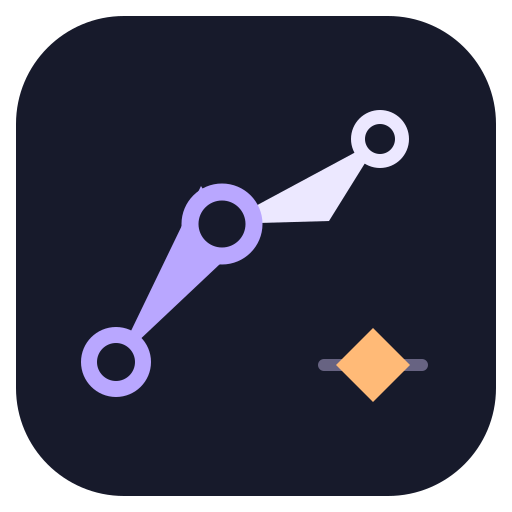

# AgeSkeleton



独立的 **2D 骨骼动画编辑器**，用于制作骨架、绑定图片与蒙皮、调整权重、编辑关键帧动画并导出资源。基于 Godot 源码开发。

A standalone **2D skeletal animation editor** built on Godot, with rigging, skinning, weight painting, keyframe animation and resource export.

无需账号登录或在线授权。原创代码及图标采用 MIT 许可证，第三方组件保留各自许可证。

## 功能 / Features

- **骨架 / Rigging**：骨骼层级、姿态编辑、IK。
- **蒙皮 / Skinning**：图片附件、网格细分、自动绑定、权重笔刷。
- **动画 / Animation**：时间轴、属性关键帧、插值曲线、播放与指定时间预览。
- **组织 / Organization**：皮肤、插槽、附件与绘制顺序。
- **工作区 / Workspace**：画布、动画片段、时间轴、层级树、属性可独立拖动停靠、合并页签或浮动；布局按工程保存。
- **导入导出 / Import and export**：Spine JSON 导入、工程保存及资源导出；不代表兼容 Spine 的所有版本和特性。
- **AI 操作 / AI authoring**：本地结构化接口，支持创建、编辑、验证、保存及截图；不内置大模型。

当前构建脚本面向 **Windows x64**。其他平台源码和历史模板仍保留，但不代表各平台已完成运行验收。

## 原创示例 / Original sample

仓库提供 **Moonwing（月翼龙）**：原创矢量贴图、12 根骨骼、10 个蒙皮附件及 Soar／Glide 两段循环动画，采用 MIT 许可证。翼膜包含渐变权重，可用于练习蒙皮与动画。素材、骨架与运动来自 `tools/generate_moonwing.py`，来源记录见 `samples/moonwing/provenance.json`。

```powershell
python tools/open_editor.py --project samples/moonwing
```

Moonwing includes original vector artwork, a 12-bone rig, ten skinned attachments and two looping animations under MIT. Open the project, switch to **Animate**, select **Soar** or **Glide**, then press Play. The left toolbar selects editing tools; transform values and diamond keyframe buttons are in the right inspector. Animation clips sit beside the timeline.

左侧工具栏用于选择、移动、旋转、缩放、建骨与权重绘制；右侧属性区编辑变换并用菱形按钮插入关键帧。切换到顶栏的“动画”模式，在底部动画列表选择 Soar 或 Glide 后播放。

拖动面板页签到另一面板边缘可分割停靠，拖到中间可合并，拖出工作区可成为独立窗口。页签最右侧三个点提供关闭、浮动和最大化；顶栏“面板”菜单可重新打开面板或重置布局。旋转工具拖动圆环；缩放工具拖动轴端方块调整单轴，拖动中心方块等比缩放。

Drag a panel tab to an edge to split, to the center to merge, or outside the workspace to float. The three-dot menu controls each panel; **Panels** reopens closed panes and resets the layout. Drag the rotation ring, the scale axis squares, or the central uniform-scale handle.

发行打包使用明确文件清单，只收录编辑器、许可及 Moonwing 示例，不扫描本机工作区、历史案例或导出目录：

```powershell
python tools/package_release.py --output ../AgeSkeletonData/Exports/AgeSkeleton-Windows.zip
```

The package includes a SHA-256 inventory and opens Moonwing by default. Packaging does not change a development build into an optimized release build.

## 直接使用 / Run the existing build

编译完成后，打开项目内的 `bin/` 目录，运行：

```text
AgeSkeleton.exe
```

双击该程序即可启动。如果使用源码构建，可在源码根目录运行以下命令；示例数据目录须与编译时一致，并已包含构建产物和工程。

Run these commands from the source checkout:

```powershell
$env:AGESKELETON_DATA_ROOT = [System.IO.Path]::GetFullPath("../AgeSkeletonData")
python tools/open_editor.py
```

打开其他已有工程 / Open another project:

```powershell
python tools/open_editor.py --project "../MyProjects/MySkeleton"
```

指定目录必须包含 `project.godot`。`AgeSkeleton.console.exe` 是带控制台输出的伴随启动器，须与 `AgeSkeleton.exe` 放在同一目录。

### 基本制作流程 / Authoring workflow

1. 在工程菜单中新建或打开骨骼工程。
2. 在设置模式下建立骨骼层级，加入图片附件。
3. 将图片绑定到骨骼；需要变形时细分网格并调整权重。
4. 切换到动画模式，创建动画，添加位置、旋转、缩放等关键帧。
5. 播放检查姿态与蒙皮，调整时间和插值。
6. 保存工程，再按需要导出资源。导出前保留可继续编辑的原工程。

Create a rig, attach and bind images, adjust weights, animate keyframes, preview, save and export.

## 从源码编译 / Build from source

准备 / Requirements:

- Windows x64。
- Python 3.9 或更新版本，能够通过 `python` 命令调用。
- SCons；建议安装最新版本以匹配 Visual Studio 工具链。
- Visual Studio C++ 构建工具及 Windows SDK，安装“使用 C++ 的桌面开发”工作负载。

以下命令均在源码根目录执行。源码直接位于仓库根目录，包含完整构建输入。普通构建不需要重新生成图标；仅运行 `tools/generate_icon.py` 时需要 Pillow。

```powershell
$env:AGESKELETON_DATA_ROOT = [System.IO.Path]::GetFullPath("../AgeSkeletonData")
python -m pip install --upgrade scons
python tools/build.py --jobs 8
python tools/open_editor.py
```

`--jobs` 指定并行编译任务数，可按内存和 CPU 情况调整。构建成功后，程序生成在项目内的 `bin/`：`AgeSkeleton.exe` 和 `AgeSkeleton.console.exe`。编译中间文件位于 `bin/obj/`。缺少默认工作区时会在数据目录创建空白工程，不覆盖已有工程。

Executables and compiler output stay in the local `bin/` directory. Existing workspace projects are preserved.

查看待执行的构建步骤 / Inspect the build plan:

```powershell
python tools/build.py --dry-run
```

`bin/` 是实际目录，不创建快捷方式或目录联接。构建脚本生成 `bin/workspace.path`，记录默认工作区位置，因此直接双击 EXE 也能打开外部工作区。命令行 `--path` 可覆盖此设置。

`bin/` is a real local directory. `workspace.path` selects the default project without directory links; an explicit `--path` takes precedence.

### 自定义数据目录 / Custom data directory

通过 `AGESKELETON_DATA_ROOT` 指定源码之外的数据目录。本文示例使用源码目录同级的 `AgeSkeletonData/`，也可以选择其他位置；构建、启动和回归须使用相同配置：

```powershell
$env:AGESKELETON_DATA_ROOT = [System.IO.Path]::GetFullPath("../AgeSkeletonData")
python tools/build.py --jobs 8
python tools/open_editor.py
```

此设置只选择工作区和案例等数据的位置，不会自动迁移已有工程。编译输出始终位于源码根目录的 `bin/`。

## 目录说明 / Layout

源码目录 / Source checkout:

```text
AgeSkeleton/
├─ modules/age_skeleton/       骨骼制作工具 / Skeleton authoring tools
├─ core/ editor/ scene/ ...    底层源码 / Engine source
├─ thirdparty/                 第三方代码及许可 / Third-party code
├─ tools/                      构建、启动和 AI 客户端 / CLI tools
├─ bin/                        程序及编译产物 / Executables and compiler output
├─ SConstruct                  SCons 构建入口 / Build entry
└─ README.md
```

外部数据目录 / External data directory:

```text
AgeSkeletonData/
├─ Project/
│  ├─ Workspace/               默认工作区 / Default workspace
│  └─ AI-Authoring-Example/     本地 AI 案例 / Local AI example
├─ Build/
│  ├─ SDK/                     本地 SDK 工具 / Local SDK tooling
│  └─ Template/                平台导出模板 / Export templates
├─ Exports/                    按平台分类的导出 / Platform exports
└─ Reports/                    日志、截图和备份 / Reports and backups
```

SDK、平台模板、案例和旧产物属于本机外部数据，并非源码克隆后自动附带的内容。编译编辑器与导出各平台游戏包是两个步骤；游戏导出需要匹配的模板和平台工具链。

## 回归验证 / Validation

```powershell
python tools/validate.py --log "$env:AGESKELETON_DATA_ROOT/Reports/regression.log"
```

脚本在临时工程中运行内置回归；返回码为 `0` 且输出 `PASS` 表示通过。可用 `--binary` 指定另一个 EXE。自定义数据目录时，按需要修改 `--log` 路径。

The regression uses a temporary project. A passing headless test does not replace visual or device testing.

## AI 操作入口 / AI interface

为指定工程启用本地接口 / Enable the local API for a project:

```powershell
$project = Join-Path $env:AGESKELETON_DATA_ROOT "Project/Workspace"
& "./bin/AgeSkeleton.exe" --editor --path $project -- --ecs-ai-editor
```

启动后，在该工程的 `.godot` 目录中查找当前进程的 `session.json` 会话文件。可用以下命令列出会话路径；多个进程同时运行时，选择对应进程目录中的文件：

```powershell
Get-ChildItem -LiteralPath "$project/.godot" -Filter session.json -Recurse
```

客户端按 JSON 步骤执行操作：

```powershell
python tools/skeleton_ai.py "会话文件路径/session.json" "制作步骤.json"
python tools/skeleton_ai.py --help
```

先读取能力和当前状态，再提交修改；编辑器按版本检查并发修改，失败或超时后先核查状态，不要盲目重放。截图需要图形窗口，不能在 headless 模式下进行视觉验证。

## 许可证 / License

AgeSkeleton 原创代码与图标采用 [MIT](LICENSE.txt)。允许使用、修改、商用和再分发，须保留相应版权和许可声明。

Godot 及其他第三方组件遵循各自许可证，见 [第三方说明](THIRD_PARTY_NOTICES.md) 和 [版权清单](COPYRIGHT.txt)。本项目不包含 Spine 编辑器或其商业运行时；第三方素材的使用权须由使用者自行取得。

AgeSkeleton 是独立项目，与 Esoteric Software 无隶属、合作或认可关系。Spine 名称仅用于描述格式兼容；导入、转换或重新打包不会改变原素材的许可条件。本项目不随附 Spine 官方示例素材。

AgeSkeleton is independent and is not affiliated with, sponsored by, or endorsed by Esoteric Software. Spine is referenced only to describe format compatibility. Importing or converting an asset does not change its license. Official Spine example artwork is not included.

Original AgeSkeleton code and artwork are MIT-licensed. Preserve the licenses and notices of Godot and all other third-party components.
